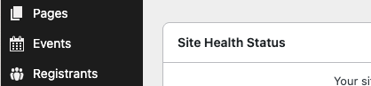
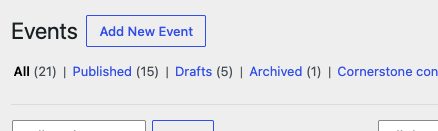
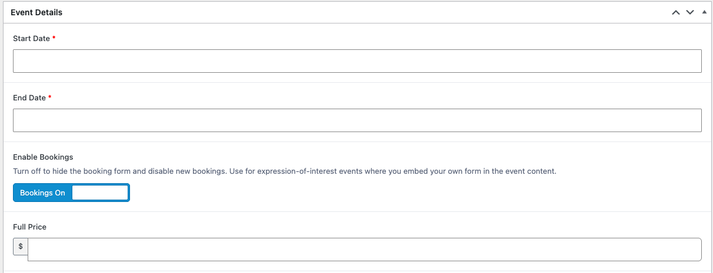
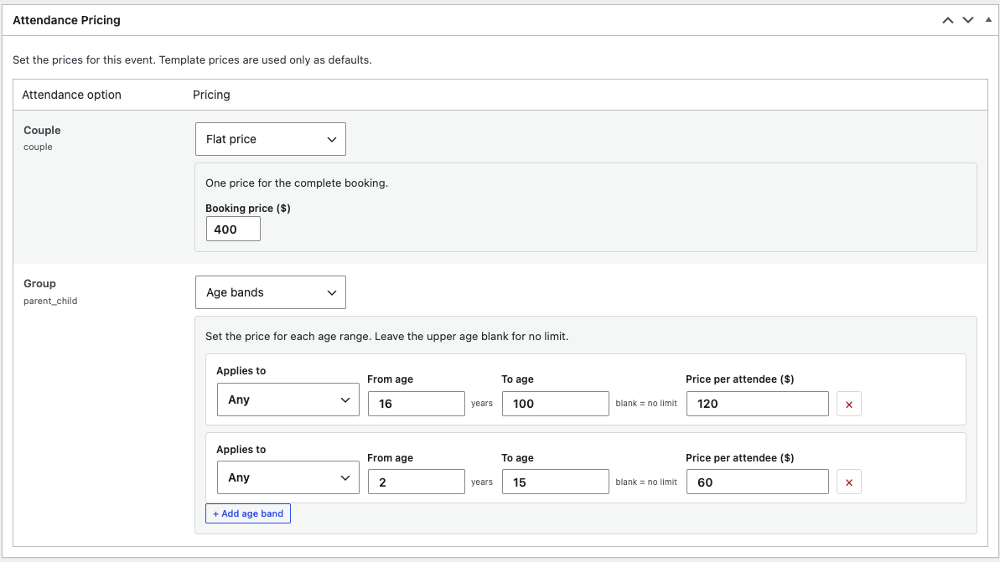
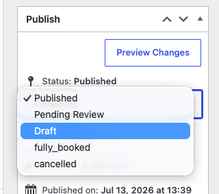
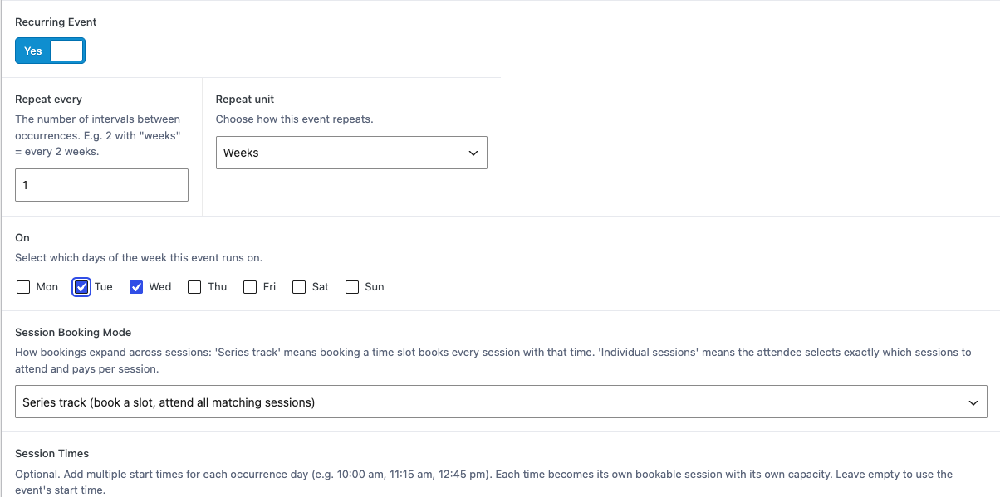
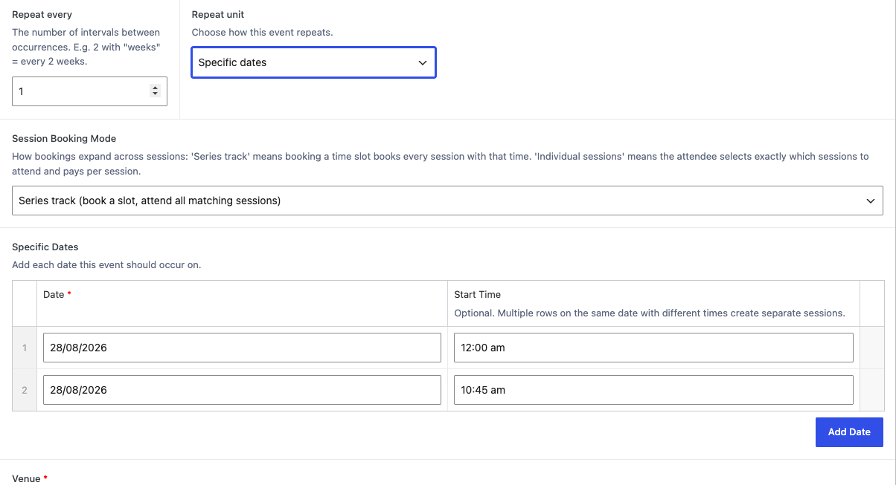
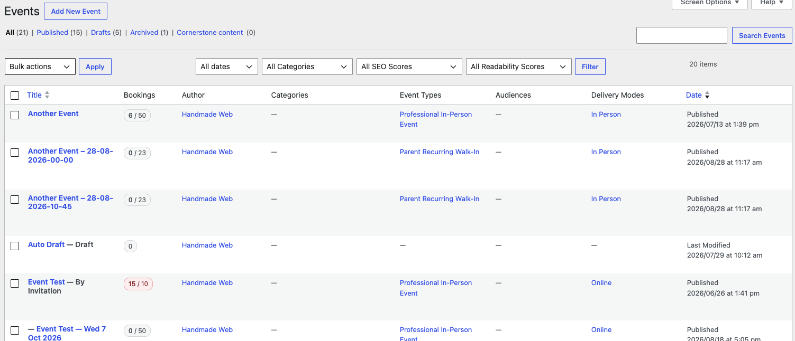

# Adding Events

Everything your clients can book lives under the **Events** menu in
WordPress.

## Create a new event

1. In the WordPress admin, go to **Events → Add New** (or click
   **Add New** at the top of the **All Events** screen).

2. Give the event a clear title — this is what clients see when booking, for
   example "Preliminary Breastfeeding Class — Tuesday Evenings".
3. Use the large content box to describe the event. Add anything clients
   need to know: what to bring, parking, arrival times.
4. Set an image with **Featured Image** (bottom right) — this is used on
   event listings and cards.
5. Fill in the **Event Details** section below the content box (see next
   section).
6. Click **Publish** when the event is ready for bookings.

## Event Details explained

| Field | What it does |
|---|---|
| **Start Date** / **End Date** | When the event runs. Both fields are required and include a time as well as a date. |
| **Enable Bookings** | Turns bookings on or off for this event. Switch it off for events that do not take bookings through the site. |
| **Capacity** | How many places are available. When capacity is reached the event can be marked Fully Booked. |
| **Full Price** | The standard price per place. Hidden when the event has per-option pricing (see below). |
| **Deposit Price** | Optional. A smaller amount payable now to secure a place. |
| **Booking Surcharge** | Optional. A flat fee added to every booking for this event. |
| **Free Event** | Mark the event as free — no payment step at booking. |
| **Max Bookings Per Person** | Stops one person from reserving too many places. Enter 0 for unlimited. |
| **Allow Net Terms / Pay Later** | Lets approved clients book now and pay later by invoice. For invitation-only events; it overrides the Free Event setting. |
| **Venue** | Choose the venue from your saved locations. |
| **Webinar URL** | The online meeting link, for online events. |
| **Booking Notes** | Extra instructions shown to clients during booking. |
| **Notification Email Override** | Send booking notifications for this event to a different email address. |
| **Organizer** | Who runs this event. |

## Prices with more than one attendance option

If the event offers more than one attendance option — for example Individual,
Couple, and Parent + Child — a separate **Attendance Pricing** box appears in
the main column of the event editor. It replaces the single Full Price field:

1. Find the **Attendance Pricing** box.
2. For each attendance option, choose a pricing style:
   - **Flat price** — one price for the complete booking.
   - **Per attendee (role)** — each attendee is charged the Adult or Child
     price based on their attendee type.
   - **Age bands** — a price for each age range. Leave the upper age blank
     for no limit.
3. Click **Update** to save.

The template's prices are used only as starting defaults — whatever you set
here is what clients pay. Attendance options themselves are defined in the
template; see [Event Templates](event-templates.md).

## Event statuses

The status controls how the event behaves:

| Status | Meaning |
|---|---|
| **Draft** | Still being worked on. Only staff can see it. |
| **Published** | Live and open for bookings. |
| **Fully Booked** | All places are taken. The event still appears, but booking is closed. |
| **Cancelled** | The event is no longer running. Clients searching the site will not see it. |
| **Archived** | Hidden from the website entirely. Use for old events you want to keep on record. |

You change the status from the **Publish** box on the event editor, using the
**Status** dropdown, then save. The dropdown only offers the statuses that
make sense next for the event's type — for example an Archived event can go
straight back to Published, but a Draft cannot jump directly to Archived.

> **Caution:** Setting an event to **Cancelled** asks you to confirm, because
> cancelling also cancels the event's confirmed bookings and notifies those
> clients.

> **Tip:** A published event can also be made invitation-only. Tick
> **Invitation Only** in the **Access Control** box on the right of the event
> editor — the event is then marked **By Invitation**, hidden from public
> listings, and can only be booked through an invitation link.

## Recurring events

If the same event runs again and again, you do not need to create each one
by hand. Set **Recurring Event** to Yes and choose one of two approaches.

First choose how bookings work across the series with **Session Booking
Mode**:

- **Series track** — booking a time slot books every session with that time.
  Clients book once and attend the whole series.
- **Individual sessions** — clients pick exactly which sessions to attend and
  pay per session.

### Option A: repeat on a pattern

Use this when the event repeats regularly — every week, every fortnight, and
so on.

1. Set **Repeat every** to a number (for example 2 for "every two weeks").
2. Set **Repeat unit** to Days, Weeks, or Months.
3. If you chose Weeks, tick the days the event runs under **On**.
4. Under **Session Times**, click **Add Time** for each start time. Each time
   becomes its own bookable session with its own capacity. Leave this empty
   to use the event's start time.
5. Under **Ends**, choose when the pattern stops:
   - **Never** — keeps repeating (you can archive events later).
   - **On a specific date** — stops after the date you pick in **End date**.
   - **After a number of occurrences** — stops after the number of sessions
     you enter in **After this many occurrences**.

6. Click **Update**. The individual sessions are created for you and appear
   in the **All Events** list underneath the main event.

### Option B: specific dates

Use this when the dates do not follow a neat pattern — for example a course
running on the 4th, 18th, and 25th of a month.

1. Set **Repeat unit** to Specific dates.
2. Under **Specific Dates**, click **Add Date** for each date and fill in the
   **Date** and, optionally, a **Start Time**. Two rows on the same date with
   different times create two separate sessions.

3. Click **Update**. One event is created per date.

> **Tip:** Sessions created from a recurring event are linked to the main
> event. Edit the main event to change shared details; edit an individual
> session to change just that day. Any change you make directly on a session
> is preserved even if the series is regenerated.

## After publishing

- Check the event as a client would with the **View Event** link at the top
  of the editor.
- The **All Events** screen shows each event's status at a glance — Fully
  Booked, Cancelled, and Archived events are labelled.
- The **Bookings** column in the list shows how many places are taken
  against the event's capacity (for example 12 / 20). The badge highlights
  as the event fills up and when it is full. The column counts people with
  confirmed bookings — it never changes the event's status; marking an
  event Fully Booked is still done manually from the status dropdown.
- The **Duplicate** link under each event in the list copies the event into a
  new draft — handy for running the same event again without a template.
  Archived events also show a **Restore** link that republishes them.

