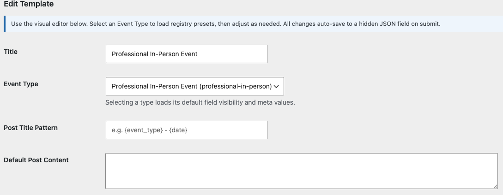
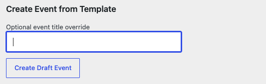
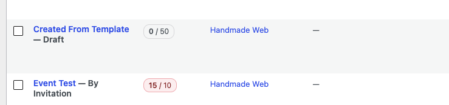
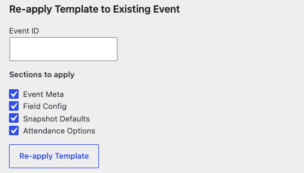

# Assigning Templates

There are two ways to put a template to work:

- **Create a new event from a template** — the normal workflow.
- **Re-apply a template to an event that already exists** — useful when a
  template has been improved and you want older events to catch up.

## Create an event from a template

1. Go to **Handmade Web Event Manager → Event Templates**.
2. Click **Edit** next to the template you want to use.

3. Scroll to the **Create Event from Template** section under the editor.
4. Optionally type an **event title override**. Leave it blank and the
   template's title pattern decides the name.

5. Click **Create Draft Event**.

WordPress opens the new event for you straight away. It is created as a
**Draft** with everything from the template applied: the visible fields, the
registration form, the attendance options, and any default values. Fill in
the specifics (dates, capacity, price) and click **Publish** when ready. You
can also find the draft later under **Events → All Events**.

> **Tip:** Creating from a template never touches the template itself. Feel
> free to experiment.

## Re-apply a template to an existing event

If a template has been improved — say a new field was added to the
registration form — you can push those changes onto an existing event.

1. Go to **Handmade Web Event Manager → Event Templates** and click
   **Edit** on the template.
2. Scroll to **Re-apply Template to Existing Event**.
3. Enter the **Event ID** of the event to update. You can find the ID in the
   address bar when editing the event — the number after `post=`.

4. Choose which parts to apply:

| Section | What it re-applies |
|---|---|
| **Event Meta** | Default values pre-filled on the event. |
| **Field Config** | Which event fields are shown, hidden, or required. |
| **Snapshot Defaults** | The stored copy of template settings created with the event. |
| **Attendance Options** | The booking options clients can choose. |

5. Click **Re-apply Template**.

> **Caution:** Re-applying overwrites the event's current field settings
> with the template's. If someone has hand-tuned the event, check with them
> first — or use a Template Override instead (see
> [Overriding Templates](overriding-templates.md)).
