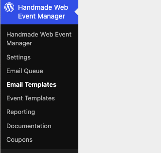
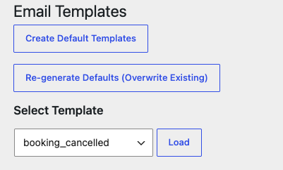
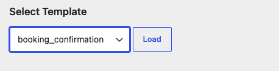
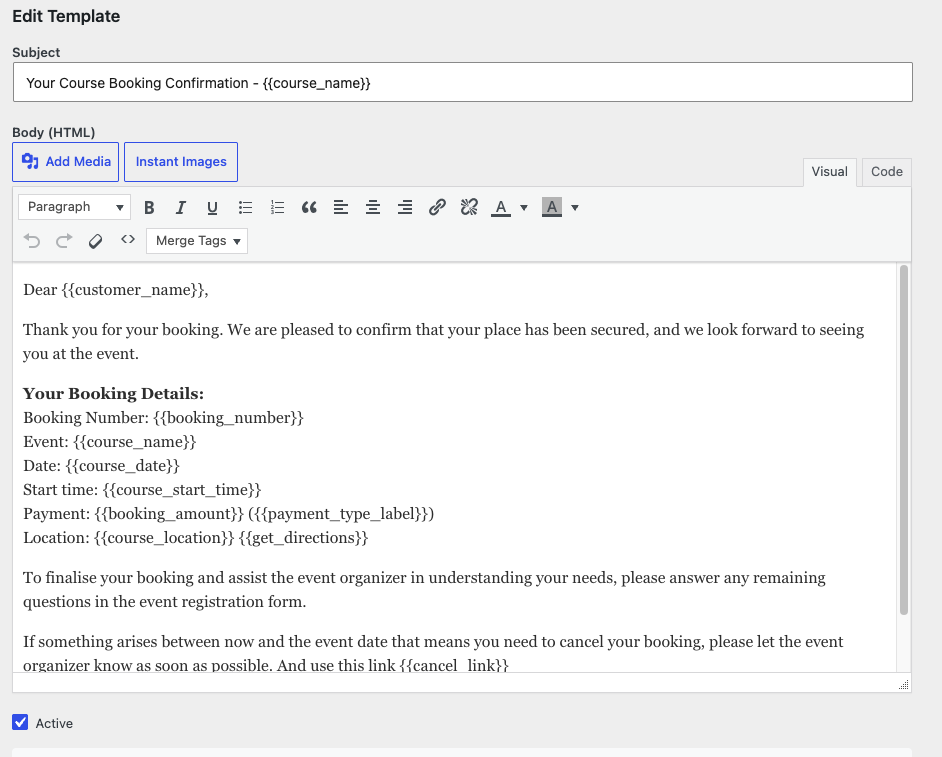
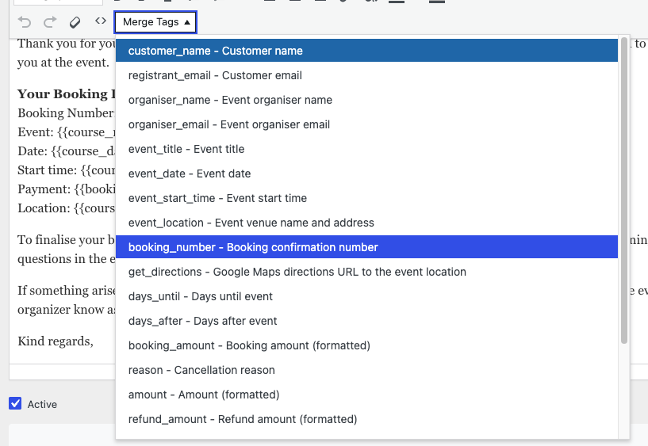
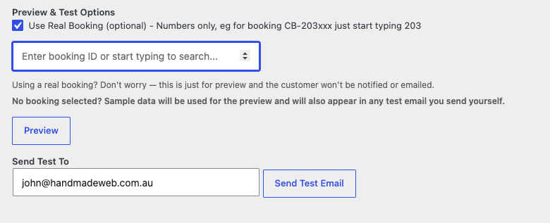
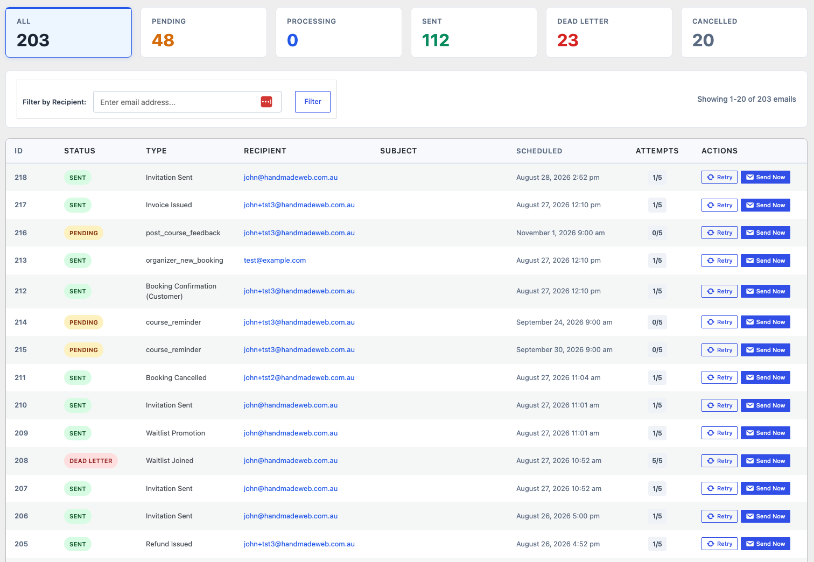

# Email Templates

The plugin sends emails automatically as bookings happen: confirmations,
receipts, reminders, and more. The **Email Templates** screen lets you edit
the wording of those emails, preview them, and send yourself tests.

Open it under **Handmade Web Event Manager → Email Templates**.

## First-time setup

If no templates exist yet, click **Create Default Templates** — this
generates the base set of emails, ready to customise.

> **Caution:** **Re-generate Defaults (Overwrite Existing)** replaces your
> templates with fresh defaults. Only use it if you want to discard your
> customisations.

## Edit an email

1. Under **Select Template**, choose the email you want from the dropdown.
   The list uses short internal names, such as `booking_confirmation` for
   the booking confirmation — ask your web team if you are unsure which is
   which.
2. Click **Load**.

3. Edit the **Subject** and the **Body (HTML)**.
4. Set the template **Active** so it is used for new emails.
5. Click **Save Template**.

## Available variables

Emails can include booking details automatically — the client's name, the
event date, the booking reference, and so on. Below the editor, the
**Available Variables** list shows everything you can use. Copy a variable
into the subject or body, or use the **Merge Tags** dropdown in the editor
toolbar.

> **Tip:** Always test an email after adding a new variable — a mistyped
> variable will show as blank text to the client.

## Preview and send a test

Before trusting your changes, check them:

1. Under **Preview & Test Options**, optionally tick **Use Real Booking** and
   start typing a booking number to preview with that booking's real data.
   If you leave it unticked, sample data is used.
2. Click **Preview** to see the rendered email on screen.

3. Enter your own address in **Send Test To** and click **Send Test Email**.

> **Note:** Using a real booking for a preview is safe — it is for display
> only and the client is never emailed.

## Which emails are sent when

The plugin sends emails automatically at these moments:

| Trigger | When it fires |
|---|---|
| **Booking Confirmed** | A booking is confirmed. |
| **Payment Received** | A payment succeeds. |
| **Booking Cancelled** | A booking is cancelled. |
| **Refund Issued** | A refund is processed. |
| **Invoice Issued** | A pay-later (net terms) booking is invoiced. |
| **Waitlist Joined** | Someone joins the waitlist for a full event. |
| **Waitlist Promotion** | A place opens and a waitlisted client is promoted. |
| **7-Day Reminder** | Seven days before the event. |
| **1-Day Reminder** | One day before the event. |
| **Post-Event Follow-Up** | After the event has run. |
| **Event Details Changed** | You change details of an event that has bookings. |
| **New Booking (Organizer)** | The organizer is notified of a new booking. |
| **Invitation Sent** | An invitation is sent for an invitation-only event. |

The exact set depends on the event's template and type.

## The Email Queue

Every automatic email is queued before sending. Check on it under
**Handmade Web Event Manager → Email Queue**:

- Counters at the top show emails that are **Pending**, **Processing**,
  **Sent**, in **Dead Letter** (failed after retries), or **Cancelled**.
- Use **Filter by Recipient** to find emails for a particular client.
- Each row offers **Retry** (reset the email so the system tries again) and
  **Send Now** (send it immediately).
- Under **Notification Settings** you can disable email types you do not
  want sent — disabled types are never queued.

> **Tip:** If a client says they never received an email, check the queue
> before rebooking them — the email may be sitting in Pending or Dead
> Letter. Use **Send Now** to push it out, or **Notification Settings** if
> that email type should not be sent at all.
