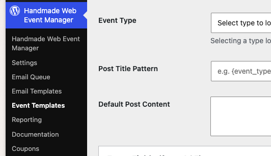
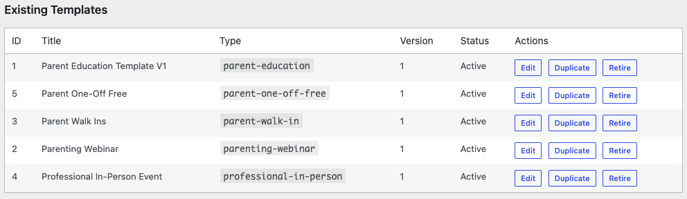
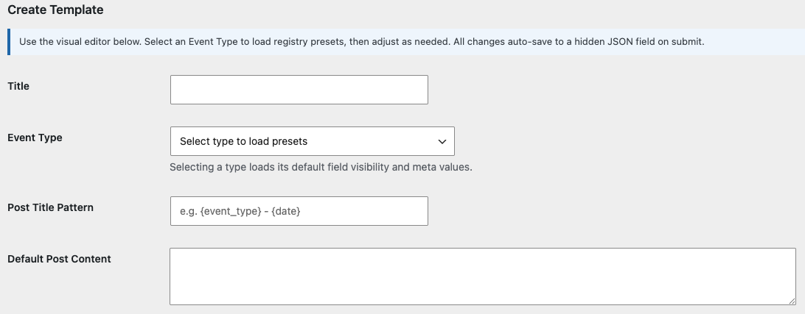
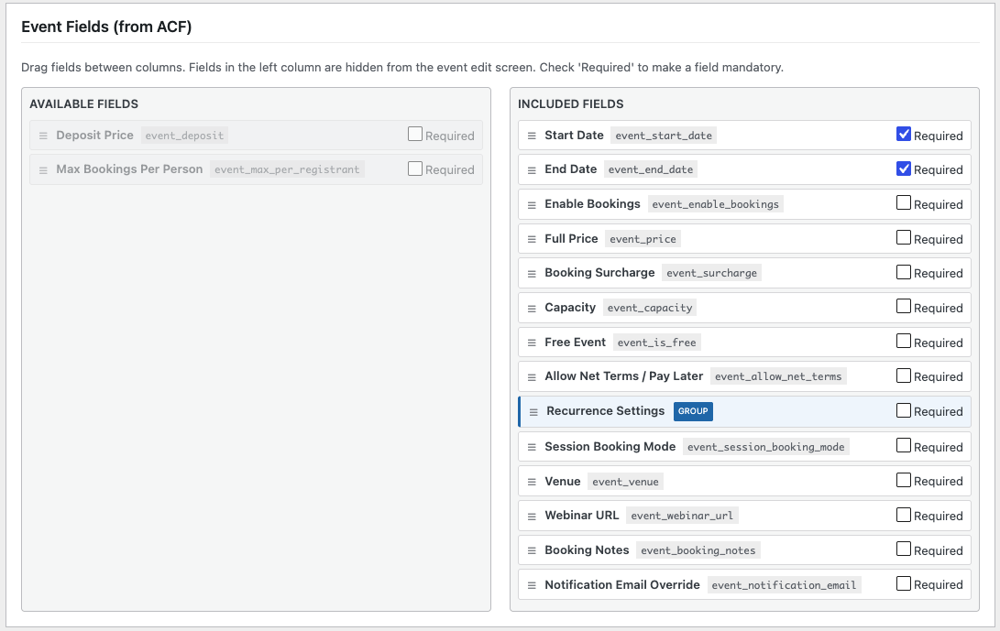
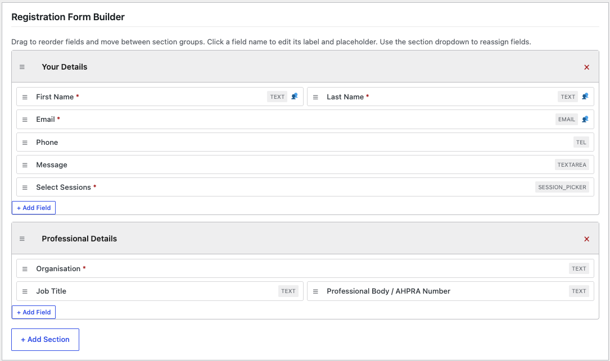
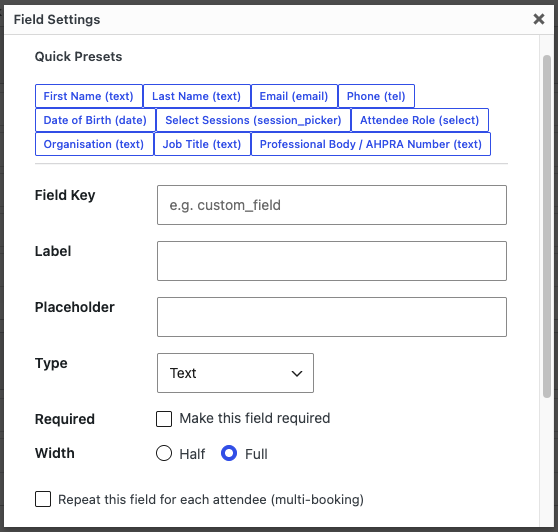
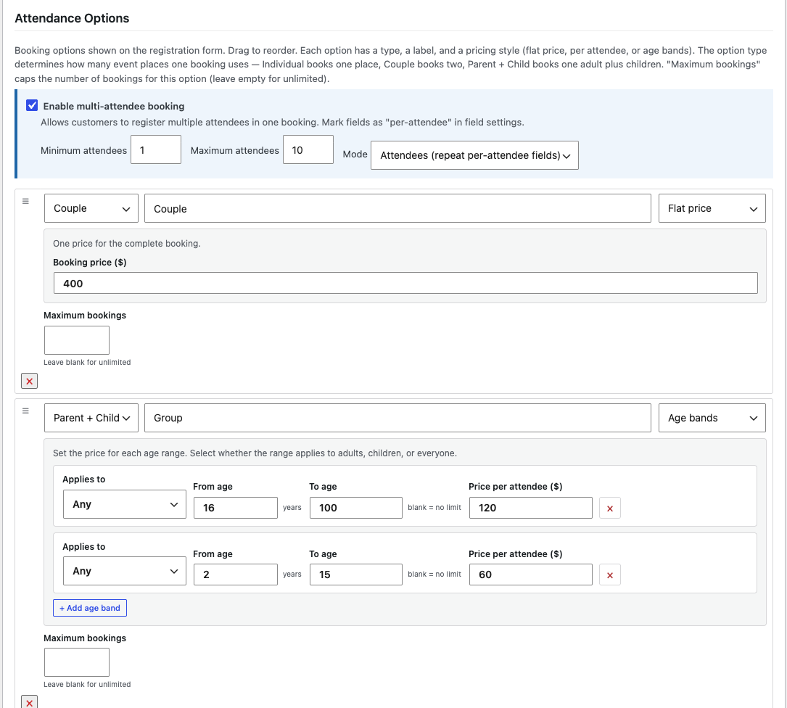
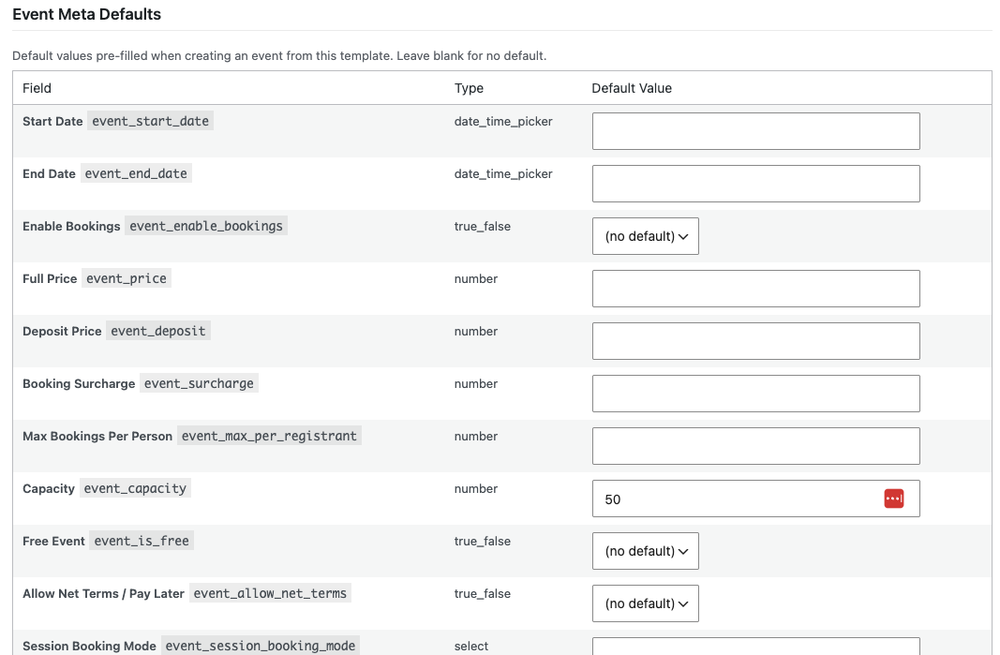

# Event Templates

A template is a reusable blueprint for events. It controls:

- which **event details fields** are shown or hidden,
- what the **registration form** asks clients when they book,
- which **attendance options** are offered (for example Individual,
  Couple, or Parent + Child),
- and the **default values** pre-filled on every event created from it.

Templates are managed under **Handmade Web Event Manager → Event
Templates**. To put one to work, see
[Assigning Templates](assigning-templates.md).

## The Event Templates screen

The top of the screen, **Existing Templates**, lists every template with its
ID, title, type, version, and status. Each row has three actions:

| Action | What it does |
|---|---|
| **Edit** | Open the template in the editor below. |
| **Duplicate** | Make a copy you can change into a new template. |
| **Retire** | Retire a template so it is no longer offered. Nothing is deleted — you can **Unretire** it later. |

## Create a template

1. Scroll to **Create Template**.
2. Enter a **Title** — use something your team will recognise, for example
   "Prenatal Class — Standard".
3. Choose the **Event Type**. Picking a type loads that type's default field
   settings as your starting point.

4. Optionally set a **Post Title Pattern** (for example `{event_type} - {date}`)
   and **Default Post Content** — the description text pre-filled on new events.
5. Configure the three builders explained below.
6. Click **Create Template**. When editing an existing template this button
   reads **Update Template**.

> **Tip:** Most of the time you will not need the **Show JSON** or **Show
> advanced editor** links at the bottom of the form. They exist for your web
> team.

## Event Fields (from ACF)

This builder decides which fields appear on the event editor screen when
staff create or edit an event.

- **Drag fields between the two columns.** Fields in the left column are
  hidden from the event editor; fields in the right column are shown.
- Tick **Required** on any field staff must always fill in.

## Registration Form Builder

This builder designs the form clients fill in when they book.

- **Drag to reorder** fields, and move them between sections to control the
  layout of the form.
- **Click a field name** to edit its label and placeholder.
- Use **Quick Presets** in the field settings window to instantly add
  standard fields such as first name, last name, email, and phone.

When you add or edit a field, the settings window lets you set:

| Setting | What it does |
|---|---|
| **Field Key** | Internal name for the field — leave as generated unless your web team advises otherwise. |
| **Label** | The question the client sees. |
| **Placeholder** | Faint hint text inside an empty field. |
| **Type** | Text, Email, Phone, Textarea, Select / Dropdown, Checkbox, Radio, Date, Number, File Upload, or Session Picker. |
| **Required** | Makes the field mandatory. |
| **Width** | Whether the field takes the full form width or half of it, side by side with the next field. |
| **Options** | For dropdowns, checkboxes, and radios — the choices the client can pick. |
| **Repeat this field for each attendee** | Shown when multi-attendee bookings are on — collects the answer for every person booked. |

The window also lists **Attendance Options** tickboxes. Leave them all
unticked and the field appears for every booking type; tick some to show the
field only for those booking types.

> **Tip:** Mark fields such as phone numbers as optional unless you truly
> need them. Shorter forms get more completed bookings.

## Attendance Options

Attendance options are the booking choices clients see on the registration
form — for example Individual, Couple, or Parent + Child. The option type
decides who one booking covers, and therefore how many places one booking
uses.

- **Drag to reorder** how the options appear, and remove one with the **×**
  button. Use **+ Add Option** for a new row.
- For each option you set:
  - **Type** — what the booking covers: individual, parent, parent + child,
    couple, or professional.
  - **Label** — the wording clients see, for example "Early Bird".
  - **Pricing** — one of three styles:
    - **Flat price** — one price for the complete booking.
    - **Per attendee** — separate Adult and Child prices.
    - **Age bands** — a price for each age range (leave the upper age blank
      for no limit).
  - **Maximum bookings** — caps how many bookings of this option can be sold
    (leave empty for unlimited).

> **Tip:** These prices are only the template's starting defaults. Each event
> can set its own prices in the **Attendance Pricing** box on the event
> editor — see [Adding Events](adding-events.md).

## Event Meta Defaults

Any value you set here is pre-filled on the event when it is created from
this template — start date conventions, default capacity, and so on. Leave a
field blank to leave it empty on new events.

