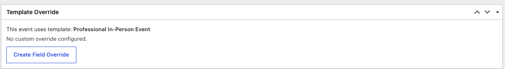
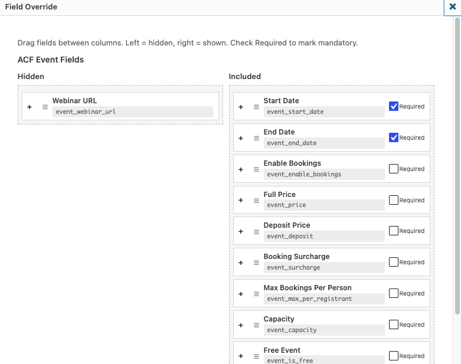
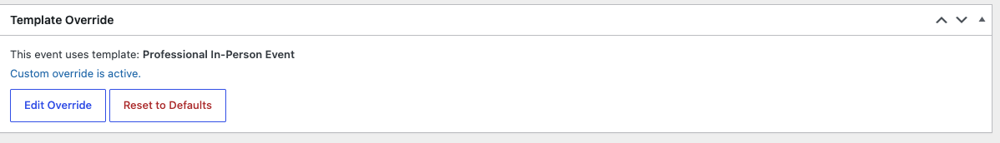

# Overriding Templates

Sometimes one event needs to differ from its template — an extra question on
the booking form, or a field hidden just for that session. A **Template
Override** does this for a single event without changing the template
everyone else uses.

## Where to find it

Open any event in the editor and look for the **Template Override** box on
the right. It tells you what the event currently follows:

- **"This event uses template:"** followed by the template name, or
- **"This event uses event type defaults"** if no template is attached.

If the box instead says *"No field configuration saved yet. Set an event type
and save the event first"*, save the event once and the box will fill in.

## Create an override

1. In the **Template Override** box, click **Create Field Override**.

2. **ACF Event Fields** — drag fields between the two columns:
   - **Hidden** (left) — removed from this event's editor.
   - **Included** (right) — shown on this event's editor.
   - Tick **Required** on fields that must be filled in.
3. **Registration Fields** — adjust the booking form for this event using
   the same drag-and-drop controls. Click a field name to edit its label,
   placeholder, or type. Use **Quick Presets** to add standard fields.
4. Click **Save Override**.

The box now shows **"Custom override is active."** with two new buttons:

| Button | What it does |
|---|---|
| **Edit Override** | Reopen the override editor to make further changes. |
| **Reset to Defaults** | Remove the override entirely so the event follows its template again. |

## Apply the override to recurring sessions

If the event is a recurring series, the override can cascade to every session
in the series. This covers both kinds of series — sessions generated from a
repeat pattern (daily, weekly or monthly) and events created from the
**Specific Dates** list.

1. In the override editor, tick **Apply to all child sessions**. The tickbox
   is always visible. Until the event has sessions attached it is greyed out,
   with a note underneath explaining that the override applies to this event
   only — generate the sessions first, then reopen the override editor and
   tick it.
2. Click **Save Override**.

Existing sessions update immediately (draft sessions included), and any
sessions generated later inherit the override automatically.

> **Tip:** Leave **Apply to all child sessions** unticked if sessions should
> keep following the template individually — for example when each date
> needs different booking questions.

## Overrides versus editing the template

| Change | Where to make it |
|---|---|
| Affects **all events** using the template | Edit the template (see [Event Templates](event-templates.md)) |
| Affects **one event** only | Create a Template Override on that event |
| Affects **one event and its sessions** | Override + tick **Apply to all child sessions** |

> **Caution:** If you find yourself maintaining the same override on many
> events, that is a sign the template itself should change. Update the
> template and remove the overrides.
